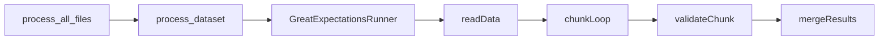

# AG-2097: Platform-aware GX for large datasets (chunked validation)

## Context

- CI runs [`adt configs/model_ad_preprod.yaml --platform GITHUB`](.github/workflows/dev.yml) without `--upload`; GX still runs whenever `gx_enabled` is true in YAML.
- [`GreatExpectationsRunner.run()`](src/agoradatatools/gx.py) always does `pd.read_json` on the full file, optional nested JSON stringification, then a single pandas validation—this scales poorly for outputs like `rna_de_individual` (~700k+ rows).
- [`process_all_files`](src/agoradatatools/process.py) already has `platform` but does not pass it to [`process_dataset`](src/agoradatatools/process.py).

## Chunked GX: is it possible?

**Yes.** You can partition the dataset into contiguous row windows (or stratified shards), run the same checkpoint / expectation suite **once per chunk**, and **merge** results so the run fails if any chunk fails. That matches the goal: “GX over the complete dataset” in the sense that **every row is eventually validated** by at least one chunk pass for expectations that are **row-wise or chunk-local**.

**Critical caveats (must be designed in, not hand-waved):**

1. **Peak memory vs today’s JSON**
   If implementation is still `pd.read_json` on one giant JSON array, you already materialize the full table **before** chunking—so chunking only helps **GX’s working memory during validation**, not the read peak. To actually fix CI OOM from file size, you likely need **one of**: chunked/streaming parse (e.g. NDJSON / ijson / pyarrow if you change export), **or** writing a temporary **partitioned** format (Parquet shards) at ETL output for GX-only, **or** accepting skip-on-CI for the heaviest path until read is chunked.

2. **Expectations that are not chunk-equivalent**
   Rules like `expect_compound_columns_to_be_unique` or `expect_table_row_count_to_equal` are **global**. If you run them on each chunk independently, you only check uniqueness **within** that chunk; duplicates spanning chunk boundaries are **invisible**. Same for table-level stats.
   **Mitigation (pick one or combine):**
   - **Suite split / meta tags:** Mark expectations as `chunk_safe: true` in `meta`; in chunked mode, filter the suite to only those. Run **full-table** expectations in a separate path (Nextflow, nightly, or a second pass with a smaller in-memory representation—e.g. key columns only for uniqueness).
   - **Two-phase CI:** Phase A = chunked row/column rules on all rows; Phase B = one lightweight SQL/pandas uniqueness pass on `(ensembl_gene_id, …)` streamed from disk (outside GX) if you want CI to still catch cross-chunk dupes without full GX on all columns.

3. **Nested columns**
   Per-row `json.dumps` for nested fields should happen **per chunk** after slicing, not on the full frame first (if you can avoid building the full frame—again ties back to read strategy).

## Recommended approach for AG-2097

**Primary deliverable:** Config-driven **sequential chunked GX** when `platform` is in a allowlist (e.g. `GITHUB`) and `gx_chunk_rows` is set (optional `gx_chunk_on_platform: [GITHUB]` so prod/local default stays single batch).

**Behavior:**

- Load data using the best available strategy from the spike (ideal: never hold full `DataFrame`; acceptable v1: hold full `DataFrame` but validate in slices and `del`/reuse to shrink GX peak—document limited RAM win).
- Loop `for start in range(0, nrows, chunk_size): chunk = df.iloc[start:start+chunk_size]` (or equivalent), run existing validator flow on `chunk`, accumulate success/failure/warning maps like today’s `set_warnings_and_failures` but **merged across chunks** (same expectation failing in any chunk ⇒ overall failure).
- When chunked mode is on, use **chunk-filtered expectation suite** (filter by `meta.chunk_safe` or alternate suite name in config, e.g. `gx_expectation_suite_chunked`) so global rules are not mis-run per chunk.

**Fallback / escape hatch:** Keep optional `gx_skip_on_platform: [GITHUB]` for datasets where even chunked read is not ready—so CI never blocks `dev`.

**Large vs small datasets:** No runtime “large file” detection. Chunked GX runs **only** when the dataset block in YAML sets `gx_chunk_rows` (and platform matches `gx_chunk_on_platform`). New large datasets opt in explicitly; everything else keeps today’s single-batch behavior.

## Implementation steps

1. **Thread `platform` through the pipeline**
   Same as before: [`process.py`](src/agoradatatools/process.py) `process_dataset` + `process_all_files` + [`tests/test_process.py`](tests/test_process.py) call sites.

2. **YAML-only config + resolver** (names can be bikeshedded)
   - `gx_chunk_rows`: positive int; if absent, always single-batch GX (current behavior).
   - `gx_chunk_on_platform`: list of platform strings, e.g. `["GITHUB"]`; if absent when `gx_chunk_rows` is set, pick a single documented default (e.g. `GITHUB` only) or require explicit list—team choice.
   - `gx_expectation_suite_chunked` or convention: filter suite by `meta["chunk_safe"] == true` or alternate suite name.
   Implement a small helper (e.g. `_gx_chunk_row_size(platform, dataset_cfg) -> Optional[int]`) that returns `gx_chunk_rows` when platform matches, else `None`. No `stat()`, no row-count heuristics.
   Document in CONTRIBUTING and in YAML comments for each dataset that opts into chunking.

3. **Spike chunked read** (short time-box)
   Determine whether [`load.df_to_json`](src/agoradatatools/etl/load.py) / current output can support streaming/chunked consumption without rewriting Agora contract. Outcomes drive whether v1 is “chunked validate only” or “chunked read + validate.”

4. **`GreatExpectationsRunner` changes** ([`gx.py`](src/agoradatatools/gx.py))
   - Factor `run_once(df)` for single batch.
   - Add `run_chunked(df, chunk_rows, suite_filter)` or load iterator API.
   - Merge multiple `CheckpointResult` / validation result lists into the existing `DatasetReport` fields (and Synapse HTML: either upload last chunk’s doc only, or concatenate links—decide smallest viable: e.g. single combined HTML or “see logs for chunk index”).

5. **Expectation suites**
   For each dataset that uses chunking, add `meta: { "chunk_safe": true }` to row-level expectations; omit or mark `false` for compound uniqueness / row count. Optionally add a small **non-GX** or **single-column** duplicate check in CI if product requires it.

6. **Wire `model_ad_preprod`**
   Set `gx_chunk_rows` (tuned after local memory test) for `rna_de_individual` (and any sibling large outputs).

7. **Tests + docs**
   - Tests with a small synthetic JSON and `gx_chunk_rows=2`, assert N runs and merged failure if chunk 1 fails.
   - CONTRIBUTING: semantics, uniqueness limitation, read vs validate memory.

## Out of scope (defer)

- Spark GX execution engine.
- Automatic HTML report merging across chunks (unless trivial).
- Changing Agora’s published JSON contract—any Parquet/NDJSON staging for GX should be internal/staging-only unless product agrees.
- Auto-detection of large files (by bytes, row count, or sidecar metadata)—optional future ticket if maintainers want it later; AG-2097 stays YAML-driven only.

## Success criteria

- GHA `build` job completes for Model-AD preprod with GX enabled on large datasets using chunked mode.
- No false confidence: global expectations are not run per-chunk without an alternative.
- Defaults unchanged for datasets without chunk config.
- Tests + CONTRIBUTING updated.
